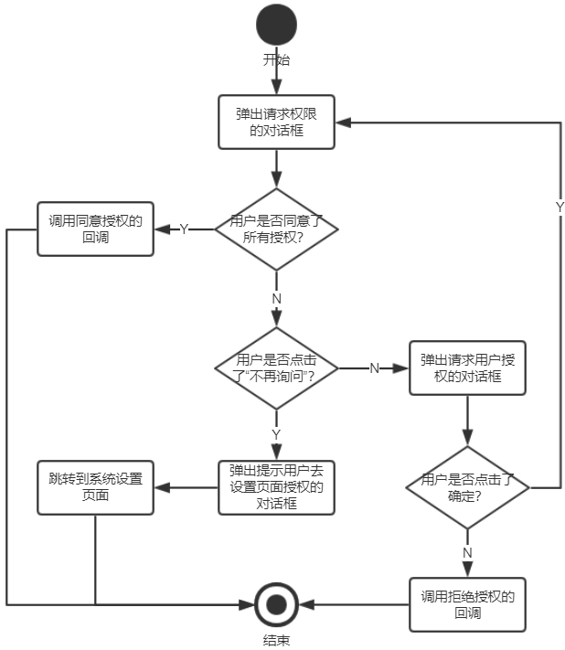

# GPermission

[](https://jitpack.io/#ITGungnir/GPermission)


`GPermission`是对`RxPermissions`的封装，其业务流程如下图所示：



## Import
第一步，在项目根目录下的`build.gradle`文件中引入`Jitpack`的库路径：
```groovy
allprojects {
    repositories {
        // Your codes ...
        maven { url 'https://jitpack.io' }
    }
}
```

第二步，在需要依赖`GPermission`的`Module`下的`build.gradle`文件中添加依赖：
```groovy
dependencies {
    // Your codes ...
    // GPermission
    implementation "com.github.ITGungnir:GPermission:$permission_version"
}
```

## Usage
第一步，在`AndroidManifest.xml`文件中添加要请求的权限：
```xml
<manifest>
    <uses-permission android:name="android.permission.WRITE_EXTERNAL_STORAGE" />
    <uses-permission android:name="android.permission.READ_PHONE_STATE" />
    <uses-permission android:name="android.permission.CAMERA" />
    <!-- Your codes -->
</manifest>
```

**【重要！！！】** 第二步，设置将要进行权限请求的`Activity`的`configChanges`或`screenOrientation`属性：
```xml
<application
    android:name=".App"
    android:allowBackup="true"
    android:icon="@mipmap/ic_launcher"
    android:label="@string/app_name"
    android:roundIcon="@mipmap/ic_launcher_round"
    android:supportsRtl="true"
    android:theme="@style/AppTheme"
    tools:ignore="AllowBackup, GoogleAppIndexingWarning">
    <activity
        android:name=".SplashActivity"
        android:configChanges="keyboardHidden|orientation|screenSize">
        <intent-filter>
            <action android:name="android.intent.action.MAIN" />
            <category android:name="android.intent.category.LAUNCHER" />
        </intent-filter>
    </activity>
    <activity
        android:name=".MainActivity"
        android:screenOrientation="portrait" />
</application>
```

第三步，在适当的地方请求权限：
```kotlin
// with()方法中的参数可以是 FragmentActivity或Fragment的子类
GPermission.with(this)
    // 设置当权限没有被赋予时，弹框提醒用户；如果不添加此方法，则不会弹框提醒用户
    .showDialogAtPermissionRejection()
    // 请求权限成功时的回调
    .onGranted {
        startActivity(Intent(this, MainActivity::class.java))
        finish()
    }
    // 请求权限失败时的回调
    .onDenied { finish() }
    // 开始请求权限
    .request(
        Manifest.permission.WRITE_EXTERNAL_STORAGE to "文件读写",
        Manifest.permission.READ_PHONE_STATE to "获取手机状态"
    )
```
```kotlin
GPermission.with(this)
    .onGranted {
        Toast.makeText(this, "Camera permission granted", Toast.LENGTH_SHORT).show()
    }
    .request(
        Manifest.permission.CAMERA to "相机"
    )
```

`GPermission`还提供了验证权限是否已获取的方法：
```kotlin
tvResult.text = GPermission.with(this).allGranted(
    Manifest.permission.WRITE_EXTERNAL_STORAGE,
    Manifest.permission.READ_PHONE_STATE
).toString()
```

## License
```text
Copyright 2019 ITGungnir

Licensed under the Apache License, Version 2.0 (the "License");
you may not use this file except in compliance with the License.
You may obtain a copy of the License at

    http://www.apache.org/licenses/LICENSE-2.0

Unless required by applicable law or agreed to in writing, software
distributed under the License is distributed on an "AS IS" BASIS,
WITHOUT WARRANTIES OR CONDITIONS OF ANY KIND, either express or implied.
See the License for the specific language governing permissions and
limitations under the License.
```