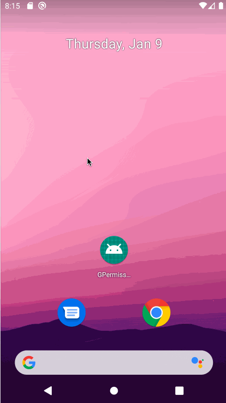

# GPermission

[](https://jitpack.io/#ITGungnir/GPermission)


`GPermission`是对`RxPermissions`的封装，其业务流程如下图所示：


`GPermission`支持的功能和特性如下：
* 使用`RxJava`实现，通过响应式的编程范式，优化代码结构；
* 使用`Kotlin`编写，借助其函数式编程特性，减少不必要的代码量；
* 通过链式编程的形式请求权限，简单易懂且可读性高；
* 提供了一套内置的弹框样式，将最小学习成本降到最低，可无脑上手；
* 具有高扩展性，用户可以自由控制是否弹框及弹窗样式，还可以将弹框逻辑替换为其他自定义的逻辑；
* 支持一行代码判断指定权限是否都被允许。



## 引入依赖
第一步，在项目根目录下的`build.gradle`文件中引入`Jitpack`的库路径：
```groovy
allprojects {
    repositories {
        // Your codes ...
        maven { url 'https://jitpack.io' }
    }
}
```

第二步，在需要依赖`GPermission`的`Module`下的`build.gradle`文件中添加依赖：
```groovy
dependencies {
    // Your codes ...
    // GPermission
    implementation "com.github.ITGungnir:GPermission:$permission_version"
}
```

## 使用注意事项
1、需要在`AndroidManifest.xml`文件中添加要请求的权限：
```xml
<manifest>
    <uses-permission android:name="android.permission.WRITE_EXTERNAL_STORAGE" />
    <uses-permission android:name="android.permission.READ_PHONE_STATE" />
    <uses-permission android:name="android.permission.CAMERA" />
    <!-- Your codes -->
</manifest>
```

**【重要！！！】** 2、设置将要进行权限请求的`Activity`的`configChanges`或`screenOrientation`属性，或者固定屏幕的方向：
```xml
<application
    android:name=".App"
    android:allowBackup="true"
    android:icon="@mipmap/ic_launcher"
    android:label="@string/app_name"
    android:roundIcon="@mipmap/ic_launcher_round"
    android:supportsRtl="true"
    android:theme="@style/AppTheme"
    tools:ignore="AllowBackup, GoogleAppIndexingWarning">
    <activity
        android:name=".MainActivity"
        android:configChanges="keyboardHidden|orientation|screenSize">
        <intent-filter>
            <action android:name="android.intent.action.MAIN" />
            <category android:name="android.intent.category.LAUNCHER" />
        </intent-filter>
    </activity>
</application>
```

## 使用方法
#### 1）请求权限，使用内置风格，拒绝时弹框
```kotlin
GPermission.with(this)
    // 如果加了这样代码，则说明要使用GPermission内置的弹框样式来展示弹框（即系统的AlertDialog）
    // 如果不加这行代码，则表示用户不想弹框，或想要自定义弹框样式和时机
    .showDefaultDialogsAtPermissionRejection()
    // 当所有权限都被赋予后会回调这个方法
    .onGranted { toast("所有权限均已被赋予") }
    // 当有些权限没有被赋予时会回调这个方法
    .onDenied {
        when (it) {
            true -> toast("部分权限没有被赋予，但用户并没有勾选所有的'不再提醒'")
            else -> toast("部分权限没有被赋予，且用户勾选了所有的'不再提醒'")
        }
    }
    .request(
        Manifest.permission.WRITE_EXTERNAL_STORAGE to "文件读写",
        Manifest.permission.READ_PHONE_STATE to "获取手机状态"
    )
```

#### 2）请求权限，使用内置风格，拒绝时不弹框
```kotlin
GPermission.with(this)
    .onGranted { toast("请求到了相机权限") }
    .onDenied {
        when (it) {
            true -> toast("用户禁止了相机权限，但没有勾选'不再提醒'")
            else -> toast("用户禁止了相机权限，且勾选了'不再提醒'")
        }
    }
    .request(
        Manifest.permission.CAMERA to "相机"
    )
```

#### 3）请求权限，使用自定义风格，拒绝时弹框
```kotlin
btn_request_custom.setOnClickListener {
    customRequestPermissions()
}
```
```kotlin
GPermission.with(this)
    .onGranted { toast("所有权限均已被赋予") }
    .onDenied {
        if (it) {
            CustomDialog.Builder()
                .message("弹出这个对话框说明用户拒绝了部分权限，但并没有勾选所有的'不再提醒'")
                // 当用户点击确定按钮时，重新请求权限
                .onConfirm { customRequestPermissions() }
                .onCancel { toast("用户禁止了相机权限，但没有勾选'不再提醒'") }
                .create()
                .show(supportFragmentManager, CustomDialog::class.java.simpleName)
        } else {
            CustomDialog.Builder()
                .message("弹出这个对话框说明用户拒绝了部分权限，且勾选了所有的'不再提醒'")
                // 当用户点击确定按钮时，跳转到系统的设置页面，手动设置权限
                .onConfirm { openSystemSettings() }
                .onCancel { toast("用户禁止了相机权限，且勾选了'不再提醒'") }
                .create()
                .show(supportFragmentManager, CustomDialog::class.java.simpleName)
        }
    }
    .request(
        Manifest.permission.WRITE_EXTERNAL_STORAGE to "文件读写",
        Manifest.permission.READ_PHONE_STATE to "获取手机状态"
    )
```

#### 4）判断指定权限是否全部被授予
```kotlin
val allPermissionsGranted = GPermission.with(this).allGranted(
    Manifest.permission.WRITE_EXTERNAL_STORAGE,
    Manifest.permission.READ_PHONE_STATE,
    Manifest.permission.CAMERA
)
when (allPermissionsGranted) {
    true -> toast("所有权限均已被授予")
    else -> toast("部分权限没有被赋予")
}
```

## Change Log
#### v0.8.0
* 提高可扩展性，用户可以自定义弹框样式，或将弹框逻辑改为其他逻辑

#### v0.7.0
* 优化代码，解决特殊情况下发生的内存泄漏问题
* 提高可扩展性，支持权限请求失败时弹框/不弹框

## License
```text
Copyright 2019 ITGungnir

Licensed under the Apache License, Version 2.0 (the "License");
you may not use this file except in compliance with the License.
You may obtain a copy of the License at

    http://www.apache.org/licenses/LICENSE-2.0

Unless required by applicable law or agreed to in writing, software
distributed under the License is distributed on an "AS IS" BASIS,
WITHOUT WARRANTIES OR CONDITIONS OF ANY KIND, either express or implied.
See the License for the specific language governing permissions and
limitations under the License.
```